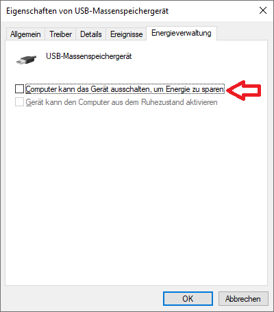

## Question
What can I do if my hardware TSE takes a lot of time to respond after some idle time, or if the Middleware cannot access it infrequently?

## Metadata tags
lang-en, market-de, middleware, PosCreator, PosDealer, PosOperator

## Answer
If the TSE (and therefore the Middleware) infrequently takes higher amounts time for processing requests, or some requests are infrequently processed by the TSE at all, it might be connected to the **USB power saving mode**. This should not be confused with the regular Windows power saving mode (which should also be disabled in case of errors), and can be set in the _Windows Device Manager_. 

1. Open the Device Manager
2. Identify the USB device that represents the TSE, **and also the USB controllers, card readers, and all other devices that might be involved**
3. Open the _Properties_ of these devices, check if there's a _Power Management_ tab (German: _Energieverwaltung_)
4. Disable the checkbox left to _'Allow the computer to turn off this device to save power'_ (German: _'Computer kann das Gerät ausschalten, um Energie zu sparen'_)

5. Either plug the device out and in again, or restart the machine

We have observed the following TSE-specific behaviors that could be connected to this issue:
- **Swissbit Hardware TSE**: After a few minutes of idle time, the first request to the Middleware takes very long (up to 30 seconds)
- **CryptoVision/Bundesdruckerei Hardware TSE**: The Middleware fails on processing requests and e.g. prints one of the following error messages to the log:
   - `Response headers didn´t match.`
   - `Expected <QWRWYW5jRUQgU2VDdVJlIFNEL01NQyBDQXJkAQ==>, but instead got <AAAAAAAAAAAAAAAAAAAAAAAAAAAAAAAAAAAAAA==>`

It's also possible to deactivate this power saving mode via Powershell, as described e.g. in these [Technet thread](https://social.technet.microsoft.com/Forums/en-US/885599c0-8233-42db-bf5b-25f8a2774434/anyone-know-a-reliable-ps-to-disable-allow-this-pc-to-turn-off-to-save-power?forum=mdt).